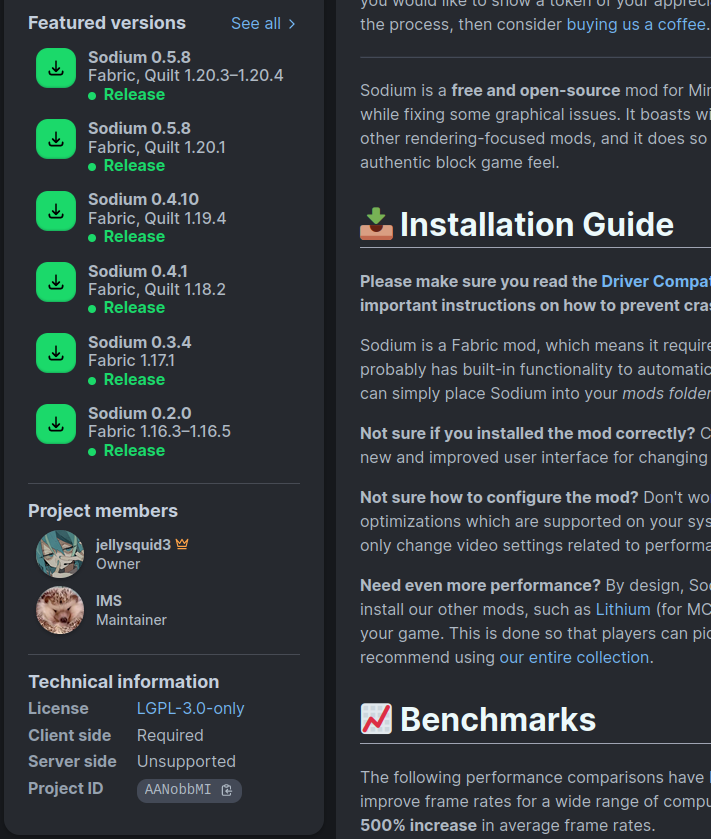

# Minecraft SMD (Simple Mod Download)

Very creative name, I know.

## For Who?

People who have a fixed set of mods that they want to upgrade or downgrade to a specific Minecraft version (like when they play on servers and MultiMC and stuff). If they have 100 mods, they'll have to update 100 of them every time they switch version. This will attempt to alleviate that without the need to use a dedicated software.

## Requirements?

- Python 3.x (stable latest is sufficient)
- Git (optional)
- A familiarity with virtual environment is recommended.

## What?

Small scripts to download mods from Modrinth and GitHub. This is tested for Fabric, but in theory it *should* work for other loaders.

There are two scripts: `modrinth.py` and `github.py`, which download from their respective sources. *Use `modrinth.py` whenever possible because it is a more dedicated platform for Minecraft modding and thus will yield more accurate downloads.* GitHub can be used as a fallback for mods that are on CurseForge or GitHub is faster to update.

## Why?

1. I'm lazy. And as with all programmers, they'll spend days to automate this process instead of manually doing it.
2. Launcher can be bulky. Something small for a task that's rarely needed is sufficient.

## Features?

- [x] Download from Modrinth.
    - [x] Ratelimit
        - It is unclear if their cdn server is also ratelimited.
    - [x] Check for valid mod (check against SHA512 or SHA1).
    - [x] Resolve dependency automatically.
        - This functionality is currently not working as expected (due to the API itself). I will do something about this later.
    - [ ] Download in parallel.
- [x] Fallback to GitHub release download.

## What about CurseForge?

Probably not going to happen. They require an API key to even do a GET request so I can't be bothered with that.

## How to use?

The next section will detail how to use the scripts.

### Download scripts

1. Download the entire repository via GitHub or Git. Note the dot at the end.

```sh
git clone https://github.com/MikeJollie2707/personal-mcmod-download.git .
```

2. Install necessary dependencies. If you know how to use `venv`, install there instead. Make sure to activate the environment with `source`.

```sh
python3 -m pip install -r requirements.txt
```

### Configure scripts

Two JSON files, `sample_modrinth.json` and `sample_gh.json`, are provided as templates to configure each scripts. The actual name of the JSON file doesn't matter. Please see [settings](#script-settings) for more details on what their structures are.

Note that for any scripts, test it out first with 1-2 small mods first to make sure the script is functional. **If you're planning to download 100+ mods (including all of its dependencies), DON'T.** Split them into two different JSON files then run them separately with some minutes inbetween.

### Run the script

Run the command below. Replace `modrinth.py` with the actual script you want to run and replace `sample_modrinth.json` with your actual JSON file correspond to the script.

```sh
python3 modrinth.py sample_modrinth.json
```

### What's next?

#### Add more mods

Follow the instruction for the entry `MODS` for each script to add more mods. Note that if you have around 100+ mods in a `.json` file, it is recommended to split that into another `.json` file to reduce the load.

#### Custom configuration

See [Settings](#script-settings).

#### Automatically download dependencies

**NOTE: This feature is currently broken.**

See [this setting](#resolve_dependencies). After this, you can remove base mods (like Fabric API) from the `.json` file.

#### Temporarily not download a mod

*Only applies to `modrinth.py`*

In the mod remark, set it to empty string, like so:

```json
{
    "MODS": {
        "mod_id": ""
    }
}
```

## Script Settings

### `modrinth.py` settings

Each key in the JSON file correspond to each of the below settings. Some are required.

#### `MC_VERSION`

*Required*
*Value Type: String*

Download mods for this particular version. For snapshots, I don't recommend using this script since 1. Hard to get the snapshot number right and 2. Not many mods will publish for snapshots, so might as well as just do that manually.

#### `MOD_LOADER`

*Required*
*Value Type: String*

Just putting it here in case you want to download `quilt` or `neoforge`.

#### `MODS`

*Required*
*Value Type: Object*

The mods to download. Each entry in the object is composed of a *mod ID* as the key and a *remark* as the value. The remark can be anything, but it is advised to put descriptive things there (like the mod's name) so it can be easily identified in the log. The key can be found on Modrinth. Click on a mod on Modrinth, look at bottom left.



#### `DOWNLOAD_PATH`

*Optional*
*Value Type: Array of Strings*

Where the mods will go. By default, it'll go `./download/{MC_VERSION}` (create if not exist). This is usually not necessary to edit since you can copy the mods to the Minecraft instance, but it's there nonetheless.

#### `CHECK_HASH`

*Optional*
*Value Type: Boolean*

Whether to verify the integrity of the file you just downloaded. This can help prevent something like `fractureiser` (maybe, it depends on how Modrinth get the public key). By default, this is `true`.

#### `RESOLVE_DEPENDENCIES`

*Optional*
*Value Type: Boolean*

Big setting. Whether to automatically download all dependencies for a given mod. By default, this is `false`. There are a few things to keep in mind before setting it to `true`:

1. It will only download the first dependency layer. If mod A depends on mod B and C, it'll download mod B and C. However, if mod B also depends on mod D, it *will not* download mod D.
2. If a mod is big (depends on like 50+ mods), it is recommended to put this mod in a separate `.json`.
3. It is very easy to overlook mods that are big with this option on. This is quite a problem if you put many big mods inside one single `.json`. It may cause timeout or some other issues.
4. If you include the dependency mods inside `.json` AND turn this setting on, *whichever entry is closer to the top will be downloaded.* This can cause issues if the parent mod depends on a very specific version of the dependency.

Most of these things are to prevent the script hitting the API ratelimit.

#### `VERBOSE_LEVEL`

*Optional*
*Value Type: String*

How noisy the script will be. `"ERROR"` will only show errors, `"WARNING"` will show errors and warnings, `"INFO"` will show `"WARNING"` and download progress. By default, it is `"INFO"`, but you can set to `"ERROR"` if it's spamming a lot.

#### `REQUIRE_FEATURED`

*Optional*
*Value Type: Boolean*

Whether to only look for the versions of the mod that's featured. Small setting, but if the script can't find a particular mod for whatever reason, you can try setting this to `false` and see if it picks up. Default to `true`.

### `github.py` settings

Each key in the JSON file correspond to each of the below settings. Some are required.

#### `MODS`

*Required*
*Value Type: Object*

The mods to download. The object is comprised of an author as the key and a list of mods under this author as the value. *This has to be exactly the same as it is on GitHub.* For example, it is "gnembon", not "Gnembon", and it is "fabric-carpet", not just "carpet" or "Carpet". To make sure this is correct, it's best to look at the GitHub URL of the project. Copy the value after `github.com/` and omit the slashes.


#### `KEYWORDS`

*Required*
*Value Type: Array of String*

The keywords to find within each mod. Because GitHub doesn't tag mod, the script will perform validity check on the filename itself. These keywords will be used to find the correct mod, so these are very important. Typically, this is basically just the Minecraft version and the word "fabric" or whatever mod loader of your choice.

Note that for intial Minecraft versions like "1.20" or "1.21", it's very likely for the script to also download their subversions like "1.20.1" or "1.20.4"

#### `DOWNLOAD_PATH`

*Required*
*Value Type: Array of String*

Where the mods will go relative to the directory you're running the script in.

#### `SEARCH_DEPTH`

*Optional*
*Value Type: Integer*
*Max value: 30*

How many releases to check per mod, starting from the latest release. Basically bigger number = higher chance of finding older version of mods, but also higher chance of duplication of same mod on same Minecraft version. By default, this is 10.

If the 30 max value is not enough, you can edit the script. Nothing is stopping you.
